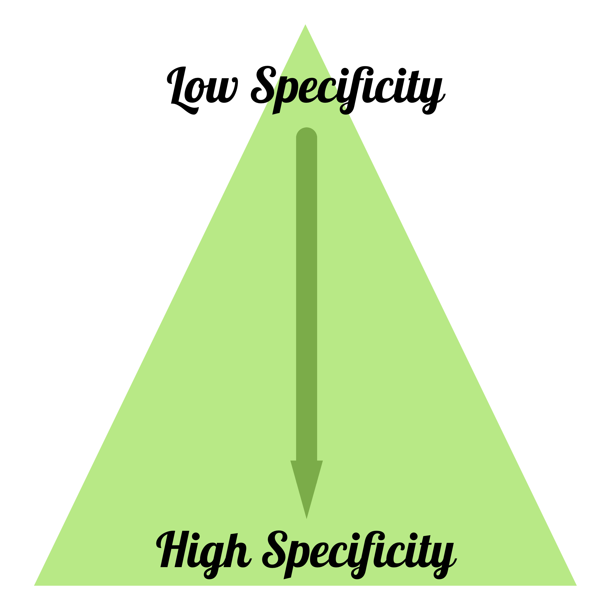

# RWD-SCSS-boilerplate
A responsive web application boilerplate built using SCSS.

## Basic Guidelines

* Keep it DRY, both HTML and CSS
* Specificity
  * Use specificity triangle when placing new elements or classes.
  * No ID's
  * Always shoot for lowest specificity possible.

.scss-lint.yml
* Utilize a reasonable naming convention, such as BEM.
* Comments when it will add value.
* Linting - Code must be formatted, clean and shiny.
